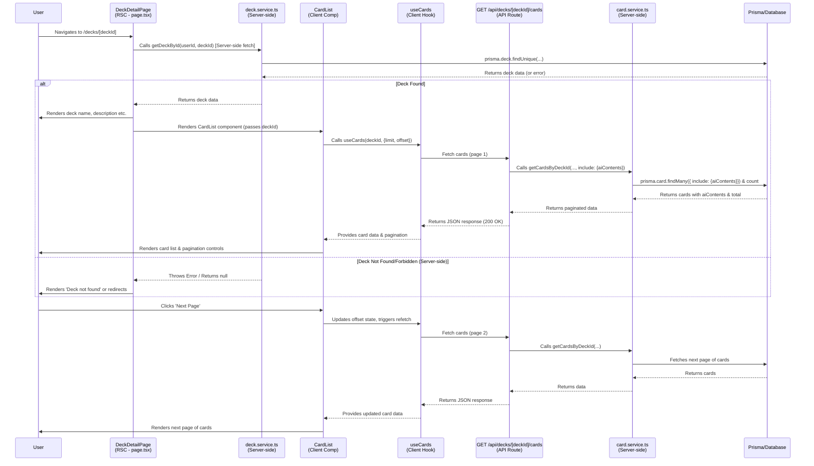

# Plan: Deck Detail Page Feature (v1.1 - AICardContent Reflected)

**(Updated: 2025-04-25)**

This document outlines the updated plan for implementing the Deck Detail Page feature, reflecting the database changes (introduction of `AICardContent`) and revising the data fetching strategy for better separation of concerns.

## Phase 1: Backend Data Fetching Logic (Revised)

The responsibility for fetching the core deck information and the list of cards within that deck will be clearly separated between the deck service/API and the card service/API.

1.  **Deck Information (`deck.service.ts`, `GET /api/decks/[deckId]`)**:

    - The `deck.service.ts` function `getDeckById(userId: string, deckId: string)` will be responsible for fetching **only the core deck information** (e.g., `id`, `name`, `description`, `createdAt`, `updatedAt`).
    - It should **not** use `include` to fetch the associated `cards`. The primary purpose is to verify existence and ownership, and return deck metadata.
    - The corresponding API endpoint `GET /api/decks/[deckId]` will reflect this, returning **only the deck's data** in the response body upon success. Authentication (`getServerUserId`) and authorization (checking ownership via `userId` in the service) remain crucial. `NotFoundError` and `PermissionError` should be handled appropriately.

2.  **Card List Information (`card.service.ts`, `GET /api/decks/[deckId]/cards`)**:
    - The `card.service.ts` function `getCardsByDeckId(userId: string, deckId: string, options: { limit, offset })` remains responsible for fetching the **paginated list of cards** belonging to the specified `deckId`. It must still verify user ownership of the deck before fetching cards.
    - **[CRITICAL UPDATE]** This service function **must be updated** to use Prisma's `include` option to fetch the associated `aiContents` (from the `AICardContent` table) for each card. This allows the API to return the necessary explanation and translation data linked to each card.
      ```typescript
      // Example modification within card.service.ts getCardsByDeckId
      // Ensure the Prisma query includes aiContents
      const [cards, totalItems] = await prisma.$transaction([
        prisma.card.findMany({
          where: { deckId: deckId }, // Deck ownership already verified
          orderBy: { createdAt: 'asc' },
          skip: validatedOffset,
          take: validatedLimit,
          include: {
            // ★ Include associated AICardContent records ★
            aiContents: {
              // Optionally select specific fields from AICardContent
              select: {
                id: true,
                contentType: true,
                language: true,
                content: true,
                // createdAt: true, // Include if needed
                // updatedAt: true, // Include if needed
              },
            },
          },
        }),
        prisma.card.count({ where: { deckId: deckId } }),
      ]);
      ```
    - The corresponding API endpoint `GET /api/decks/[deckId]/cards` will handle pagination parameters (`limit`, `offset`) and return the paginated list of cards. Each card object in the response should now include the `aiContents` array, structured as defined in the updated `api-design.md` (v1.2).

## Phase 2: Frontend Page Implementation (Revised)

The Deck Detail Page (`/decks/[deckId]`) will utilize a combination of Server Components (for initial static data) and Client Components (for dynamic, interactive parts like the card list).

1.  **Page Component (`src/app/[locale]/(app)/(main)/decks/[deckId]/page.tsx`)**:

    - This component should preferably be a **React Server Component (RSC)** to fetch initial deck data efficiently on the server.
    - It fetches **only the core deck data** (name, description) directly using the `deck.service.ts::getDeckById` function within the RSC, or by making a server-side `Workspace` call to `GET /api/decks/[deckId]`.
    - It handles loading states and potential errors (like `NotFoundError` or `PermissionError` for the deck itself) during server-side rendering.
    - It **renders the `CardList` component** (which is a Client Component), passing the necessary `deckId` as a prop.
    - It **does not** fetch or render the list of cards directly. This responsibility is delegated to `CardList`.
    - It likely also renders the `CardCreateForm` component.

2.  **Card List Component (`src/components/features/CardList.tsx`)**:
    - This **must be a Client Component** (`'use client'`) because it needs state, lifecycle effects, data fetching hooks, and interactivity.
    - It receives the `deckId` as a prop from the parent Page Component.
    - It uses the **`useCards` custom hook** (defined in `src/hooks/useCards.ts`) to fetch the paginated list of cards. This hook internally makes requests to the `GET /api/decks/[deckId]/cards` endpoint.
    - The `useCards` hook (and consequently the `CardList` component) will now receive card data that includes the `aiContents` array for each card.
    - It manages its own loading and error states related to fetching the card list.
    - It renders the list of cards, displaying `front`, `back`, and potentially information derived from the `aiContents` (e.g., showing icons indicating available explanations/translations, or allowing the user to view specific content based on language/type).
    - It implements pagination controls which modify the `offset` state used by the `useCards` hook, triggering refetches for different pages.
    - It contains the Edit/Delete buttons for each card, triggering respective mutations (which might also reside in client-side hooks).

## Data Flow Diagram (Revised)

This diagram illustrates the updated data flow with separated concerns.


