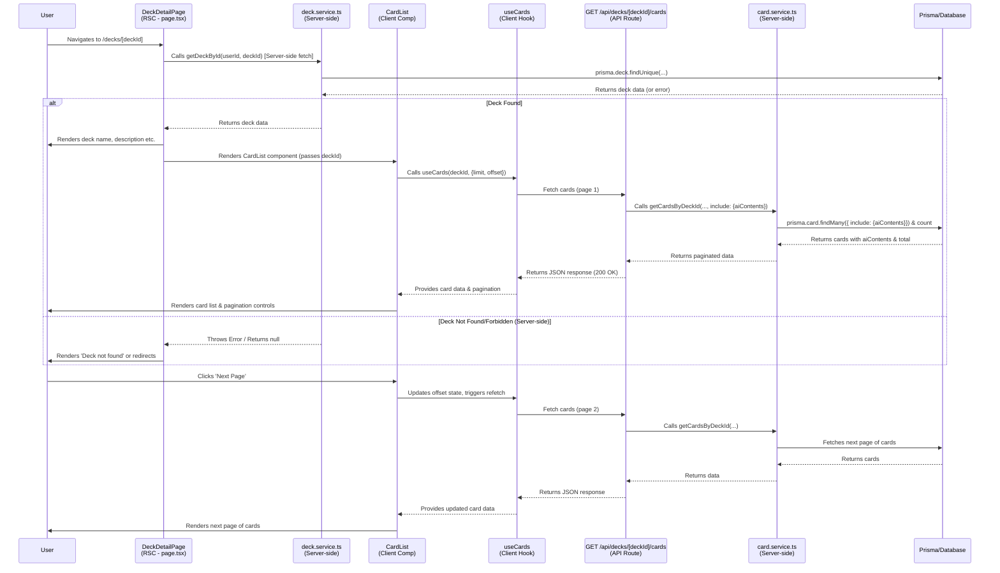

This file is a merged representation of the entire codebase, combined into a single document by Repomix.

# File Summary

## Purpose
This file contains a packed representation of the entire repository's contents.
It is designed to be easily consumable by AI systems for analysis, code review,
or other automated processes.

## File Format
The content is organized as follows:
1. This summary section
2. Repository information
3. Directory structure
4. Multiple file entries, each consisting of:
  a. A header with the file path (## File: path/to/file)
  b. The full contents of the file in a code block

## Usage Guidelines
- This file should be treated as read-only. Any changes should be made to the
  original repository files, not this packed version.
- When processing this file, use the file path to distinguish
  between different files in the repository.
- Be aware that this file may contain sensitive information. Handle it with
  the same level of security as you would the original repository.

## Notes
- Some files may have been excluded based on .gitignore rules and Repomix's configuration
- Binary files are not included in this packed representation. Please refer to the Repository Structure section for a complete list of file paths, including binary files
- Files matching patterns in .gitignore are excluded
- Files matching default ignore patterns are excluded
- Files are sorted by Git change count (files with more changes are at the bottom)

## Additional Info

# Directory Structure
```
api-design.md
coding-style.md
database-design.md
error-handling.md
feature-deck-details.md
functional-requirements.md
non-functional-requirements.md
testing-strategy.md
```

# Files

## File: api-design.md
````markdown
# API 設計 v1.2 (音声対応・AICardContent 拡充)

**(更新日: 2025-04-29)**

## 1. 目的 (変更なし)

このドキュメントは、本アプリケーションにおける API 設計の一貫性、保守性、およびクライアント（Web, Mobile アプリなど）からの利用しやすさを確保するための原則を定義します。RESTful な考え方を参考にしつつ、Next.js Route Handlers で実装します。

## 2. クライアントニュートラル (最重要原則 - 変更なし)

- API は特定のクライアントに依存せず、Web, Mobile など様々なクライアントから共通利用可能なように設計します。
- API はデータや機能を提供することに焦点を当て、UI 固有のロジックやフォーマットを含めません。

## 3. 認証 (新規追加)

- 多くのエンドポイント (特に `/api/decks`, `/api/cards` 以下) は認証が必須です。
- リクエストヘッダーに `Authorization: Bearer <Supabase JWT>` を含める必要があります。
- 認証されていない場合はステータスコード `401 Unauthorized` とエラー `{ "error": "AUTHENTICATION_FAILED", "message": "..." }` が返されます (`handleApiError` 形式)。

## 4. エンドポイント命名規則 (変更なし)

- **言語非依存:** API の URL パスは UI の表示言語から独立させ、ロケールプレフィックスを含みません (例: `/api/decks`)。API ルートハンドラは `src/app/(api)/api/...` 以下に配置します。
- **リソースベース:** URL は名詞中心 (複数形推奨) で設計します (例: `/api/decks`, `/api/cards`, `/api/ai-contents`)。
- **階層構造:** リソース間の関連はパスで表現します (例: `/api/decks/{deckId}/cards`, `/api/cards/{cardId}/ai-contents`)。
- **パスセグメント:** `camelCase` またはリソース名を基本とします。

## 5. HTTP メソッド (変更なし)

- 標準的な使い方に従います: `GET`(取得), `POST`(作成), `PUT`(置換更新), `DELETE`(削除), `PATCH`(部分更新、任意)。

## 6. リクエスト/レスポンス形式 (修正)

- **データ形式:** JSON のみを使用 (`Content-Type: application/json`)。
- **JSON キー命名規則:** **`camelCase`** で統一します。
- **レスポンス構造 (データモデル変更):**

  - カード (`Card`) 情報を返す API では、以前の `explanation`, `translation`, `frontAudioUrl`, `backAudioUrl` フィールドは含まれません。
  - 代わりに、関連する AI 生成コンテンツ（解説、翻訳、音声パス）は `aiContents` というネストされた配列として含まれる形を基本とします。各要素には `contentType` (種類), `language` (言語), `content` (内容/パス) が含まれます。
  - **カード取得レスポンス例 (`GET /api/decks/{deckId}/cards` の一部 - 更新版):**

  ```json
  {
    "data": [
      {
        "id": "clxyz123...",
        "front": "apple",
        "back": "りんご",
        "deckId": "deck-abc",
        "createdAt": "2025-04-29T00:00:00.000Z",
        "updatedAt": "2025-04-29T01:00:00.000Z",
        "interval": 0,
        "easeFactor": 2.5,
        "nextReviewAt": "2025-04-29T00:00:00.000Z",
        // frontAudioUrl, backAudioUrl は削除
        "aiContents": [
          {
            "id": "aic-abc...",
            "contentType": "EXPLANATION",
            "language": "en",
            "content": "\"Apple\" is a type of round fruit...", // テキスト
            "createdAt": "2025-04-29T01:00:00.000Z",
            "updatedAt": "2025-04-29T01:00:00.000Z"
          },
          {
            "id": "aic-def...",
            "contentType": "TRANSLATION",
            "language": "ja",
            "content": "りんご", // テキスト
            "createdAt": "2025-04-29T01:05:00.000Z",
            "updatedAt": "2025-04-29T01:05:00.000Z"
          },
          {
            "id": "aic-ghi...",
            "contentType": "AUDIO_PRIMARY",
            "language": "en-US",
            "content": "tts-audio/apple-en-us-uuid.mp3", // GCS パス
            "createdAt": "2025-04-29T01:10:00.000Z",
            "updatedAt": "2025-04-29T01:10:00.000Z"
          },
          {
            "id": "aic-jkl...",
            "contentType": "AUDIO_SECONDARY",
            "language": "ja-JP",
            "content": "tts-audio/ringo-ja-jp-uuid.mp3", // GCS パス
            "createdAt": "2025-04-29T01:15:00.000Z",
            "updatedAt": "2025-04-29T01:15:00.000Z"
          }
          // 他の言語の解説や音声があればここに追加される
        ]
      }
      // ... more cards
    ],
    "pagination": {
      /* ... */
    }
  }
  ```

## 7. データ転送オブジェクト (DTO) と型定義 (修正)

- API の Request Body および Response Body の型は `src/types/api.types.ts` で明確に定義します。
- **データモデル変更に伴う型定義の更新:**
  - `CardApiResponse` 型から `frontAudioUrl`, `backAudioUrl` を削除し、`aiContents: AICardContentApiResponse[]` を追加。
  - 新しい `AICardContentApiResponse` 型を定義。
  - `DeckApiResponse` に `cardCount` を追加。
- **更新後の型定義例 (`src/types/api.types.ts` で定義される想定):**

```typescript
// src/types/api.types.ts (抜粋・更新版)
import { AiContentType } from '@prisma/client'; // PrismaからEnumをインポート

// AICardContent の API レスポンス型
export interface AICardContentApiResponse {
  id: string;
  contentType: AiContentType; // EXPLANATION, TRANSLATION, AUDIO_*
  language: string; // 'en', 'ja', 'en-US', 'ja-JP' etc.
  content: string; // Text or GCS Path
  createdAt: string; // ISO 8601 string
  updatedAt: string; // ISO 8601 string
}

// 更新後の Card の API レスポンス型
export interface CardApiResponse {
  id: string;
  front: string;
  back: string;
  deckId: string;
  createdAt: string; // ISO 8601 string
  updatedAt: string; // ISO 8601 string
  interval: number;
  easeFactor: number;
  nextReviewAt: string; // ISO 8601 string
  // frontAudioUrl, backAudioUrl は削除
  aiContents: AICardContentApiResponse[]; // ネストされた配列
}

// PaginatedCardsResponse も CardApiResponse を使うように更新
export interface PaginatedCardsResponse
  extends PaginatedResponse<CardApiResponse> {}

// DeckApiResponse (cardCount 追加)
export interface DeckApiResponse {
  id: string;
  name: string;
  description: string | null;
  userId: string;
  cardCount: number; // ★追加
  createdAt: string; // ISO 8601 string
  updatedAt: string; // ISO 8601 string
}

export interface PaginatedDecksResponse
  extends PaginatedResponse<DeckApiResponse> {}

// 汎用ページネーションメタデータ
export interface PaginationMeta {
  offset: number;
  limit: number;
  totalItems: number;
  _links?: {
    self: string;
    first?: string;
    prev?: string;
    next?: string;
    last?: string;
  };
}

// 汎用ページネーションレスポンス
export interface PaginatedResponse<T> {
  data: T[];
  pagination: PaginationMeta;
}

// 標準エラーレスポンス
export interface ApiErrorResponse {
  error: string; // e.g., "NOT_FOUND", "VALIDATION_ERROR"
  message: string;
  details?: unknown;
}

// 他の Payload 型 (DeckCreatePayload, DeckUpdatePayload など) も必要に応じて定義
```

- Request Body のバリデーションは API Route Handler 内で Zod (`src/lib/zod.ts`) を用いて行います。

## 8. 認証・認可 (修正)

- **認証:** Supabase Auth の JWT を利用 (`Authorization: Bearer <token>`)。
- **認可:** 主に Supabase **RLS** で DB レベルで制御。API Route や Service 層でも必要に応じて所有権チェックを実施。`AICardContent` に対する操作も `Card` の所有権に基づいて認可する必要があります。

## 9. ステータスコード (変更なし)

- 標準的な HTTP ステータスコード (200, 201, 204, 400, 401, 403, 404, 409, 500 など) を適切に返却します。

## 10. エラーレスポンス (修正)

- `docs/error-handling.md` で定義された標準 JSON 形式 (`{ error: string, message: string, details?: any }`) で返却します。`error` プロパティには `lib/errors.ts` で定義された `errorCode` を使用します。
- API はエラー発生時、可能な限りこの標準形式で JSON を返します（`handleApiError` により生成）。
- `AICardContent` の操作に関するエラー（例: ユニーク制約違反 `[cardId, contentType, language]`）も適切なエラーコード (`RESOURCE_CONFLICT` など) で返す必要があります。

## 11. API レスポンスのローカライズ (変更なし)

- API の URL は言語に依存しません。
- API が返す**エラーメッセージ等**をリクエスト元の言語に合わせる必要がある場合は、将来的に HTTP リクエストヘッダーの **`Accept-Language`** を参照して処理することを検討します (現状未実装)。AI コンテンツ (`aiContents`) の言語は `language` フィールドで示されます。

## 12. バージョニング (変更なし)

- 初期リリースでは考慮しません。将来的に破壊的変更が必要な場合は URL パス (`/api/v2/...`) 等でバージョニングします。

## 13. 非同期 API Route Handler における `params` の扱い (Next.js 15+ 注意点 - 変更なし)

- `async` 関数として定義された API Route Handler 内で `params` の値を使用する場合は、プロパティにアクセスする前に、**必ず `context.params` オブジェクト全体を `await` してください。**

**背景:**

Next.js 15 (およびそれ以前の準備バージョン) では、パフォーマンス最適化の一環として、API Route Handler に渡される `params` オブジェクト（通常、第二引数の `context` オブジェクト経由でアクセス: `context.params`）は非同期 API として扱われるようになりました。

**問題:**

`async function` として定義されたハンドラ内で、`context.params` のプロパティ（例: `context.params.deckId` や `context.params.locale`）に `await` を使用せずに直接アクセスしようとすると、実行時に `Error: Route ... used \`params.property\`. \`params\` should be awaited...` というエラーまたは警告が発生します。

**解決策:**

`async` 関数として定義された API Route Handler 内で `params` の値を使用する場合は、プロパティにアクセスする前に、**必ず `context.params` オブジェクト全体を `await` してください。**

**実装例:**

```typescript
// src/app/[locale]/(api)/api/decks/[deckId]/route.ts (GETハンドラの例)

import { NextResponse } from 'next/server';
import { getServerUserId } from '@/lib/auth';
import { getDeckById } from '@/services/deck.service';
import { handleApiError } from '@/lib/errors';

// context の型を定義 (例)
type Context = {
  params: { locale: string; deckId: string };
};

export async function GET(request: Request, context: Context) {
  try {
    // --- NG な書き方 ---
    // const deckId_bad = context.params.deckId; // ← await しないとエラーが出る

    // --- OK な書き方 ---
    // context.params を await してから分割代入で取り出す
    const { deckId, locale } = await context.params;

    // --- 以降の処理 ---
    const userId = await getServerUserId();
    if (!userId) {
      // ... 認証エラー処理 ...
      return NextResponse.json({ error: 'Unauthorized' }, { status: 401 });
    }

    const deckData = await getDeckById(userId, deckId);
    return NextResponse.json(deckData);
  } catch (error) {
    return handleApiError(error);
  }
}
```

## 14. 具体的な API エンドポイント (修正・追加)

### 14.1. デッキ API (`/api/decks`)

#### GET /api/decks

- **(修正)** ログインしているユーザー自身のデッキ一覧を**ページネーション付きで**取得します。
- **認証:** 必須。
- **クエリパラメータ:** `offset` (number, default: 0), `limit` (number, default: 10)
- **成功レスポンス (200 OK):** `PaginatedDecksResponse` 型
- **エラーレスポンス:** 401, 400, 500 - `handleApiError` 形式。

#### POST /api/decks

- **(修正)** ログインしているユーザー用に新しいデッキを作成します。
- **認証:** 必須。
- **リクエストボディ:** `DeckCreatePayload` 型 (`{ name: string, description?: string }`)
- **成功レスポンス (201 Created):** 作成されたデッキ情報 (`DeckApiResponse` 型、`cardCount` 含む)
- **エラーレスポンス:** 401, 400, 409, 500 - `handleApiError` 形式。

### 14.2. 個別デッキ API (`/api/decks/{deckId}`)

#### GET /api/decks/{deckId}

- **(修正)** ログインしているユーザーが所有する特定のデッキを取得します。
- **認証:** 必須。
- **成功レスポンス (200 OK):** `DeckApiResponse` 型 (`cardCount` 含む)
- **エラーレスポンス:** 401, 403, 404, 500 - `handleApiError` 形式。

#### PUT /api/decks/{deckId}

- **(修正)** ログインしているユーザーが所有する特定のデッキを更新します。
- **認証:** 必須。
- **リクエストボディ:** `DeckUpdatePayload` 型 (`{ name?: string, description?: string | null }`)
- **成功レスポンス (200 OK):** 更新後のデッキ情報 (`DeckApiResponse` 型、`cardCount` 含む)
- **エラーレスポンス:** 401, 400, 404, 409, 500 - `handleApiError` 形式。

#### DELETE /api/decks/{deckId}

- **(修正)** ログインしているユーザーが所有する特定のデッキを削除します。
- **認証:** 必須。
- **成功レスポンス (204 No Content):** ボディなし。
- **エラーレスポンス:** 401, 404, 500 - `handleApiError` 形式。

### 14.3. カード API (`/api/decks/{deckId}/cards`, `/api/decks/{deckId}/cards/{cardId}`)

- **(追記/TODO)** これらの API も同様に認証・認可チェックを追加する必要があります。
- レスポンスの `CardApiResponse` 型が更新されています (上記セクション 6, 7 参照)。

### 14.4. AI 関連 API (新規追加)

#### POST /api/translate

- テキストを翻訳します。
- **認証:** 不要（または将来的に必要に応じて追加）。
- **リクエストボディ:** `{ text: string, sourceLanguage: string, targetLanguage: string }`
- **成功レスポンス (200 OK):** `{ success: true, translation: string }`
- **エラーレスポンス:** 400, 503, 500 - `handleApiError` 形式。

#### POST /api/tts

- テキストから音声を生成し、GCS に保存、再生用 URL と GCS パスを返します。
- **認証:** 不要（または将来的に必要に応じて追加）。
- **リクエストボディ:** `{ text: string, language: string }` (例: "en-US", "ja-JP")
- **成功レスポンス (200 OK):** `{ success: true, signedUrl: string, gcsPath: string }`
- **エラーレスポンス:** 400, 503, 500 - `handleApiError` 形式。

#### GET /api/tts/signed-url

- GCS パスから再生用の短時間有効な署名付き URL を取得します。
- **認証:** 不要。
- **クエリパラメータ:** `gcsPath` (string, 必須)
- **成功レスポンス (200 OK):** `{ success: true, signedUrl: string }`
- **エラーレスポンス:** 400, 404, 503, 500 - `handleApiError` 形式。

#### POST /api/cards/{cardId}/ai-contents

- 特定のカードに紐づく `AICardContent` レコードを作成します。
- **認証:** 必須。
- **リクエストボディ:** `{ contentType: AiContentType, language: string, content: string }`
- **成功レスポンス (201 Created):** 作成された `AICardContent` オブジェクト (`AICardContentApiResponse` 型)
- **エラーレスポンス:** 401, 400, 403, 404, 409, 500 - `handleApiError` 形式。

## 15. データモデル図 (参考 - 更新版)

```mermaid
erDiagram
    User ||--o{ Deck : owns
    User ||--o{ StudyLog : records
    Deck ||--o{ Card : contains
    Card ||--o{ AICardContent : has
    Card ||--o{ StudyLog : relates_to

    User {
        String id PK "UUID"
        String email Unique nullable
        String name nullable
        String avatarUrl nullable
        DateTime createdAt
        DateTime updatedAt
    }

    Deck {
        String id PK "CUID"
        String name
        String description nullable
        String userId FK "UUID"
        DateTime createdAt
        DateTime updatedAt
        # cardCount (Calculated, not in DB model)
    }

    Card {
        String id PK "CUID"
        String front Text
        String back Text
        String deckId FK "CUID"
        Int interval
        Float easeFactor
        DateTime nextReviewAt Timestamptz
        DateTime createdAt
        DateTime updatedAt
        # aiContents AICardContent[] (Relation)
        # frontAudioUrl, backAudioUrl REMOVED
    }

    AICardContent {
        String id PK "CUID"
        String cardId FK "CUID"
        AiContentType contentType "Enum"
        String language "e.g., en, ja, en-US"
        String content Text "Text or GCS Path"
        DateTime createdAt
        DateTime updatedAt
    }

    StudyLog {
        String id PK "CUID"
        DateTime reviewedAt
        StudyRating rating "Enum"
        Int previousInterval
        Float previousEaseFactor
        Int newInterval
        Float newEaseFactor
        DateTime nextReviewAt
        String userId FK "UUID"
        String cardId FK "CUID"
    }

    enum AiContentType {
        EXPLANATION
        TRANSLATION
        AUDIO_PRIMARY
        AUDIO_SECONDARY
        AUDIO_EXPLANATION
        AUDIO_TRANSLATION
    }

    enum StudyRating {
        AGAIN
        HARD
        GOOD
        EASY
    }
```
````

## File: coding-style.md
````markdown
# コーディングスタイルガイド

## 1. 目的

コードの一貫性、可読性、保守性を高めるためのスタイルガイドです。

## 2. 自動化ツール

プロジェクトのコード品質と一貫性を保つために、以下の自動化ツールを利用します。

- **フォーマッター:** **Prettier**

  - **目的:** コードの見た目に関するスタイル（インデント、スペース、改行など）を自動で統一します。
  - **設定:** プロジェクトルートの Prettier 設定ファイル (`prettier.config.js`, `.prettierrc.json` など) に従います。
  - **運用:** エディタの保存時自動整形 (Format on Save) の利用を強く推奨します。CI (GitHub Actions) でもフォーマットが正しいかのチェック (`bun run format:check` 等) を行うことが望ましいです。

- **リンター:** **ESLint**
  - **目的:** コードの潜在的なバグ、アンチパターン、およびスタイルガイドライン違反（フォーマッターが扱わない範囲）を静的に解析・検出します。
  - **設定:** プロジェクトルートにある **`[ESLint設定ファイル名]`** (例: `.eslintrc.json`, `eslint.config.js` など。**実際のファイル名に置き換えてください**) が、適用される ESLint ルールの**唯一の正 (Source of Truth)** となります。この設定ファイルには、TypeScript, React, React Hooks, Next.js 用のプラグインやルールが適切に設定されています（または設定されるべきです）。
  - **実行:** コードの静的解析とルールチェックは、以下のコマンドで実行します。
    ```bash
    bun run lint
    ```
    _(package.json の `scripts` 内で定義されているコマンド)_
  - **必須事項:**
    - エディタ (VS Code など) に ESLint 拡張機能を導入し、**リアルタイムでのエラー/警告表示と、可能な範囲での自動修正 (Auto Fix on Save) を有効にすること**を強く推奨します。
    - CI (GitHub Actions) でもこの `lint` コマンドが自動実行され、**エラーなくチェックをパスすることが必須**となります。すべてのコードは、上記の設定ファイルに定義された ESLint ルールに準拠する必要があります。

## 3. TypeScript

- `tsconfig.json` で `strict: true` を有効にします。
- `any` 型の使用は原則禁止します。具体的な型、`unknown`、ジェネリクスを適切に使用します。
- 型エイリアス (`type`) とインターフェース (`interface`) は、プロジェクト内で一貫した方針で使用します。（例: オブジェクトや関数の型には `type` を優先的に使用する）。
- ユーティリティ型 (`Partial`, `Readonly` など) を適切に活用します。

## 4. 命名規則

- **変数、関数:** `camelCase`
- **クラス、コンポーネント、型エイリアス、インターフェース:** `PascalCase`
- **定数:** `UPPER_SNAKE_CASE`
- **ファイル名:**
  - 一般的な `.ts` ファイル: `kebab-case.ts` (推奨)
  - React コンポーネントファイル (`.tsx`): `PascalCase.tsx`
  - テストファイル: `*.test.ts` または `*.spec.ts`

## 5. React / Next.js

- 関数コンポーネントと Hooks を使用します。
- React Hooks のルールを遵守します。
- Next.js App Router の規約（ディレクトリ構造、ファイル命名など）に従います。
- コンポーネントは小さく、単一責任の原則 (SRP) を意識します。

## 6. コメント

- コードを読めばわかる「何をしているか」ではなく、**「なぜ」** そのような実装にしたのか、という意図や背景、複雑なロジックの要点を説明するために書きます。
- `lib` や `services` 内の複雑な関数や公開するモジュールには JSDoc 形式でのコメントを推奨します。
- コミット前に不要なコメントアウトされたコードは削除します。

## 7. インポート (`import`)

- ESLint のプラグイン (`eslint-plugin-import` など) や Prettier を利用して、インポート順序を自動で整理します (例: 外部ライブラリ → 内部絶対パス (`@/`) → 相対パス)。
- `tsconfig.json` の `paths` を設定し、深い階層からの相対パス (`../../...`) を避けるために絶対パス (`@/components/...`) を可能な限り使用します。

## 8. エラーハンドリング

`docs/error-handling.md` で定義された戦略に従います。

## 9. シンプルさ

複雑すぎる実装や時期尚早な最適化よりも、明確でシンプルなコードを優先します。
````

## File: database-design.md
````markdown
# データベース設計 v1.2 (AICardContent 拡充: 音声対応)

**(更新日: 2025-04-29)**

## 1. 背景と目的 (変更なし)

当初のデータベース設計では、`Card` モデル内に AI が生成する解説 (`explanation`) と翻訳 (`translation`) を直接カラムとして保持していました。

しかし、今後のアプリケーションの発展、特に**多言語対応**（1つのカードに対して複数言語の解説や翻訳を持たせる可能性）や、**ユーザーの多様な学習スタイル**（例: 学習中の言語での解説と母国語の翻訳を併用したい）への対応を考慮した結果、AI が生成するテキストコンテンツをより柔軟に管理できる設計が必要と判断しました。

さらに、**音声コンテンツ**（テキスト読み上げ）の導入に伴い、テキストだけでなく音声ファイルの参照情報も一元的に管理する必要が出てきました。

そのため、拡張性と柔軟性を高めることを目的に、AI 生成コンテンツ（解説、翻訳、音声ファイル情報）を `Card` モデルから分離し、専用のテーブル (`AICardContent`) で管理する方針へと変更します。

## 2. 主要な変更点

1.  **`AICardContent` テーブルの新設:**
    - AI によって生成されたコンテンツ（解説テキスト、翻訳テキスト、**音声ファイルの GCS パス**）を格納するための新しいテーブルを作成します。
    - 各コンテンツがどのカードに属するか (`cardId`)、コンテンツの種類 (`contentType`)、コンテンツの言語 (`language`) を区別して管理します。
2.  **`Card` モデルの変更:**
    - 既存の `explanation` および `translation` カラムを削除します。
    - **(追記)** 既存の `frontAudioUrl` および `backAudioUrl` カラムを削除。音声情報も `AICardContent` で管理するため。
    - `AICardContent` モデルとの 1 対多リレーションを設定 (`aiContents AICardContent[]`)。
3.  **`AiContentType` Enum の更新:**
    - コンテンツの種類（解説、翻訳、**または音声**）を定義する Enum を更新し、音声の種類を詳細化しました。
4.  **リレーションの追加:**
    - `Card` モデルと `AICardContent` モデルの間に 1 対多のリレーションを設定します (`Card` 1件に対して複数の `AICardContent` レコードが紐づく）。

### 2.1. `AICardContent` テーブルの新設 (変更なし)

(このセクションは元の v1.1 の内容を指していると思われるため、実質的には上記 1. と統合される)
... (v1.1 の内容がここにあったと仮定) ...

### 2.2. `Card` モデルの変更

- 既存の `explanation` および `translation` カラムを削除。
- **(追記)** 既存の `frontAudioUrl` および `backAudioUrl` カラムを削除。音声情報も `AICardContent` で管理するため。
- `AICardContent` モデルとの 1 対多リレーションを設定 (`aiContents AICardContent[]`)。

### 2.3. `AiContentType` Enum の更新

コンテンツの種類（解説、翻訳、**または音声**）を定義します。

```prisma
// (prisma/schema.prisma より抜粋)
enum AiContentType {
  EXPLANATION       // 解説テキスト
  TRANSLATION       // 翻訳テキスト
  AUDIO_PRIMARY     // Card.front (主要テキスト) の音声
  AUDIO_SECONDARY   // Card.back (第2テキスト/答え) の音声
  AUDIO_EXPLANATION // EXPLANATION コンテンツの音声
  AUDIO_TRANSLATION // TRANSLATION コンテンツの音声
}
```

**(追記)** 音声の種類を、それがどのテキスト（主要、第2、解説、翻訳）に対応するかを示す形で定義しました。これにより、多言語の音声にも対応できます。

### 2.4. AICardContent モデルの詳細

AI 生成コンテンツ（または音声ファイル情報）を格納する新しいモデルです。

```prisma
// (prisma/schema.prisma より抜粋)
model AICardContent {
  id            String        @id @default(cuid())
  cardId        String        // どのカードか
  card          Card          @relation(fields: [cardId], references: [id], onDelete: Cascade)
  contentType   AiContentType // ★ 更新された Enum を使用 ★
  language      String        // コンテンツの言語 ('en', 'ja') または音声の言語 ('en-US', 'ja-JP')
  content       String        @db.Text // テキスト本体、または音声ファイルの GCS パス/URL
  createdAt     DateTime      @default(now())
  updatedAt     DateTime      @updatedAt

  @@unique([cardId, contentType, language])
  @@index([cardId])
  @@index([cardId, contentType])
}
```

**(追記)** `contentType` が `AUDIO_*` の場合、`content` フィールドには音声ファイルの GCS 上のパス (例: `tts-audio/uuid.mp3`) が格納されます。`language` フィールドにはその音声の言語コード (例: `en-US`) が入ります。

## 3. 新しいスキーマ定義 (`prisma/schema.prisma` より抜粋)

以下に、今回の変更に関連する主要なモデル (`Card`, `AICardContent`) と Enum (`AiContentType`) の定義を示します。完全なスキーマは `prisma/schema.prisma` を参照してください。

```prisma
// --- Enum 定義 ---
enum AiContentType {
  EXPLANATION       // 解説テキスト
  TRANSLATION       // 翻訳テキスト
  AUDIO_PRIMARY     // Card.front (主要テキスト) の音声
  AUDIO_SECONDARY   // Card.back (第2テキスト/答え) の音声
  AUDIO_EXPLANATION // EXPLANATION コンテンツの音声
  AUDIO_TRANSLATION // TRANSLATION コンテンツの音声
}

// --- モデル定義 ---

model Card {
  id            String   @id @default(cuid())
  front         String   @db.Text
  back          String   @db.Text

  // --- SRSメタデータ (変更なし) ---
  interval      Int      @default(0)
  easeFactor    Float    @default(2.5)
  nextReviewAt  DateTime @default(now()) @db.Timestamptz

  createdAt     DateTime @default(now())
  updatedAt     DateTime @updatedAt

  // --- リレーション (deck, studyLogs は変更なし) ---
  deckId        String
  deck          Deck     @relation(fields: [deckId], references: [id], onDelete: Cascade)
  studyLogs     StudyLog[]

  // ↓↓↓ AICardContent へのリレーションを【追加】↓↓↓
  aiContents    AICardContent[]

  // --- インデックス (変更なし) ---
  @@index([deckId])
  @@index([nextReviewAt])
}

model AICardContent {
  id            String   @id @default(cuid())
  cardId        String   // どのカードのコンテンツか (Cardへの参照)
  card          Card     @relation(fields: [cardId], references: [id], onDelete: Cascade) // Cardとのリレーション
  contentType   AiContentType // Enum: EXPLANATION, TRANSLATION, AUDIO_*
  language      String   // コンテンツの言語コード (e.g., 'en', 'ja', 'en-US', 'ja-JP')
  content       String   @db.Text // テキスト本体、または音声ファイルの GCS パス

  createdAt     DateTime @default(now())
  updatedAt     DateTime @updatedAt

  // 同じカードに同じ種類・同じ言語のコンテンツは原則1つ
  @@unique([cardId, contentType, language])
  @@index([cardId]) // カードIDでの検索用
  @@index([cardId, contentType]) // 特定タイプのコンテンツ取得用
}

// (User, Deck, StudyLog モデルは変更なしのため省略)
```

### 3.1. リレーション図 (Mermaid 形式 - 更新版)

```mermaid
erDiagram
    User ||--o{ Deck : owns
    User ||--o{ StudyLog : records
    Deck ||--o{ Card : contains
    Card ||--o{ AICardContent : has
    Card ||--o{ StudyLog : relates_to

    User {
        String id PK "UUID"
        String email Unique nullable
        String name nullable
        String avatarUrl nullable
        DateTime createdAt
        DateTime updatedAt
    }

    Deck {
        String id PK "CUID"
        String name
        String description nullable
        String userId FK "UUID"
        DateTime createdAt
        DateTime updatedAt
    }

    Card {
        String id PK "CUID"
        String front Text
        String back Text
        String deckId FK "CUID"
        Int interval
        Float easeFactor
        DateTime nextReviewAt Timestamptz
        DateTime createdAt
        DateTime updatedAt
        # aiContents AICardContent[] (Relation)
    }

    AICardContent {
        String id PK "CUID"
        String cardId FK "CUID"
        AiContentType contentType "Enum"
        String language "e.g., en, ja, en-US"
        String content Text "Text or GCS Path"
        DateTime createdAt
        DateTime updatedAt
    }

    StudyLog {
        String id PK "CUID"
        DateTime reviewedAt
        StudyRating rating "Enum"
        Int previousInterval
        Float previousEaseFactor
        Int newInterval
        Float newEaseFactor
        DateTime nextReviewAt
        String userId FK "UUID"
        String cardId FK "CUID"
    }

    enum AiContentType {
        EXPLANATION
        TRANSLATION
        AUDIO_PRIMARY
        AUDIO_SECONDARY
        AUDIO_EXPLANATION
        AUDIO_TRANSLATION
    }

    enum StudyRating {
        AGAIN
        HARD
        GOOD
        EASY
    }
```

## 4. 採用理由

- **多言語対応の実現:** 1つのカードに対し、複数言語の解説・翻訳・**音声**を `language` フィールドで区別して格納できる。
- **コンテンツ種類の拡張性:** 将来的に「難易度別解説」や「例文」など、新しい種類の AI コンテンツを追加する場合、`AiContentType` Enum を拡張するだけで対応可能。
- **`Card` モデルの関心の分離:** カードのコア情報（表裏、SRS データ）と、付加的な AI 生成コンテンツ（テキスト、音声パス）を分離できる。
- **ユーザーの多様な学習スタイルへの対応:** 「英語の解説」と「日本語の翻訳」を同時に取得・表示したり、複数の言語の音声を選択したりするなど、柔軟な情報提示が可能になる。
- **音声データ管理の統合:** テキストコンテンツと音声ファイルの参照情報を同じテーブルで管理することで、データの一貫性を保ちやすくなる。

## 5. パフォーマンスに関する考慮事項

`Card` データと一緒に `AICardContent` を取得する際には、Prisma の `include` 機能を使用します。関連するテーブルアクセスが増える可能性はありますが、以下の対策によりパフォーマンスへの影響は最小限に抑えられる見込みです。

- `AICardContent` テーブルに適切なインデックス（`cardId`, `contentType`, `language` など）を設定する。
- フロントエンドで不要なコンテンツまで取得しないように、必要な `contentType` や `language` でフィルタリングする（例: ユーザー設定に基づいて表示する言語を選択）。

これらの対策により、UX に影響が出るほどの顕著なパフォーマンス低下は通常発生しないと考えられます。

## 6. 影響範囲 (概要)

このデータベース設計変更は、アプリケーションの以下の部分に影響を与えます。

- **Prisma スキーマ:** 上記の通り変更し、マイグレーションを実行する必要があります。
- **サービス層 (`card.service.ts`, `ai.service.ts` など):** AI コンテンツの保存ロジック（`prisma.aICardContent.create` を使用）および取得ロジック（`include: { aiContents: true }` など）の修正が必要です。**音声ファイルの GCS パス保存ロジックもここに含まれます。**
- **API レスポンスと型定義 (`types/api.types.ts`):** カードデータの型定義から `explanation`, `translation`, **`frontAudioUrl`, `backAudioUrl`** を削除し、代わりに `aiContents` 配列を含むように修正が必要です。`AICardContent` の型定義も更新が必要です。
- **フロントエンド:** カードデータを表示するコンポーネント (`CardList` など) や、AI コンテンツを利用する機能（解説表示、翻訳表示、**音声再生**など）の修正が必要です。データ構造の変更に対応する必要があります。**音声再生は `AICardContent` から GCS パスを取得し、署名付き URL を取得して再生するフローになります。**
````

## File: error-handling.md
````markdown
# Error Handling Strategy v1.1

**(更新日: 2025-04-29)**

## 1. 目的 (変更なし)

アプリケーション全体で一貫性があり、予測可能で、デバッグしやすく、ユーザーにとっても分かりやすいエラーハンドリングを実現します。

## 2. 基本原則 (変更なし)

- **早期失敗:** 問題が発生したら、可能な限り早い段階で検知し、処理を中断します（ただし、ユーザー操作を不必要に妨げない範囲で）。
- **ログへのコンテキスト付与:** エラーログには、原因調査に必要な情報（リクエストID、ユーザーID、発生箇所、エラー詳細など）を含めます。
- **機密情報の非漏洩:** ユーザー向けの エラーメッセージには、システム内部の情報やスタックトレースなどの機密情報を含めません。
- **エラーレスポンスの標準化:** API が返すエラーレスポンスの形式を統一します。

## 3. カスタムエラークラス (`src/lib/errors.ts`) (変更なし)

アプリケーション固有のエラー状況を示すために、`Error` を継承したカスタムエラークラスを定義します。

- **ベースクラス (`AppError`):**
  - `statusCode` (HTTP status), `errorCode` (machine-readable string like `NOT_FOUND`), and optional `details` を持ちます。
- **具象クラス (例):**
  - `ValidationError` (400, `VALIDATION_ERROR`)
  - `AuthenticationError` (401, `AUTHENTICATION_FAILED`)
  - `PermissionError` (403, `PERMISSION_DENIED`)
  - `NotFoundError` (404, `RESOURCE_NOT_FOUND`)
  - `ConflictError` (409, `RESOURCE_CONFLICT`)
  - `ExternalApiError` (503, `EXTERNAL_API_FAILURE`)
  - `DatabaseError` (500, `DATABASE_ERROR`)
- **`isAppError`**: Type guard function.

## 4. エラーハンドリング: レイヤー別 (修正・統合)

### 4.1. Service Layer (`src/services/`)

- **General Guideline:** Services should handle expected operational errors (e.g., resource not found, validation failure, external API failure, DB constraint violation) and communicate them clearly to the caller (API layer). Unexpected errors (e.g., programming bugs, infrastructure issues) might still result in uncaught exceptions but should be minimized.
- **Two Patterns Used:**

  1.  **Returning `Result<T, AppError>` (Preferred for Mutations/Complex Logic):**
      - **Used In:** `deck.service::updateDeck`, `card.service::saveAiContent`, `ai.service::generateExplanation`, `ai.service::generateTranslation`, `ai.service::generateTtsAudio`.
      - **Why:** This pattern makes success and failure explicit in the return type. It forces the caller (API layer or potentially RSCs) to actively check the outcome using `if (result.ok)`. This is generally preferred for operations that modify data or involve external calls where failure is common and needs specific handling. It also aligns better with potential future direct usage from React Server Components (RSCs), as throwing errors directly from RSC data fetching can be problematic. It also aligns conceptually with error handling in languages like Go or Rust.
      - **Implementation:** Functions return `Promise<Result<SuccessType, AppError>>`. On success, return `{ ok: true, value: ... }`. On failure, create an appropriate `AppError` subclass (e.g., `NotFoundError`, `ConflictError`, `ExternalApiError`) and return `{ ok: false, error: ... }`. Internal `try...catch` blocks are used to catch errors (e.g., from Prisma or external APIs) and convert them into the error part of the `Result`. (See Section 5 for limited `try...catch` usage).
  2.  **Throwing `AppError` (Used for Getters/Deletes):**
      - **Used In:** `deck.service::getDeckById`, `deck.service::deleteDeck`, `card.service::getCardsByDeckId` (throws `DatabaseError`), `card.service::deleteCard`.
      - **Why:** For simpler "get" operations or delete operations where the primary expected error is "Not Found" (or a general DB error), directly throwing a specific `AppError` (like `NotFoundError` or `DatabaseError`) can be slightly more concise. The API layer's `handleApiError` is designed to catch these.
      - **Implementation:** Use `prisma.findUniqueOrThrow` or perform checks and `throw new NotFoundError(...)` etc. Use `try...catch` for unexpected database errors and `throw new DatabaseError(...)`. (See Section 5 for limited `try...catch` usage).

- **Decision Rationale (Result vs. Throw in Services):**
  - While initially some services used `throw` more broadly, the decision was made to adopt the `Result` pattern more consistently, especially for AI service calls and update operations. This was based on:
    - Desire for more explicit error handling paths.
    - Better alignment with potential future direct usage from RSCs.
    - Consistency with error handling idioms in languages like Go/Rust (a potential future direction mentioned by the user).
    - Existing use in `updateCard`/`updateDeck`.
  - Getters and Deletes remain using `throw` primarily for simplicity where `NotFoundError` is the main expected failure path, which `handleApiError` correctly translates to a 404 response.

### 4.2. API Route Handlers (`src/app/(api)/...`)

- **Centralized Handling:** All API route handlers (`GET`, `POST`, `PUT`, `DELETE`) wrap their main logic in a `try...catch` block at the top level. (See Section 5 for limited `try...catch` usage for specific operations like JSON parsing).
- **`handleApiError` Utility:** The `catch` block (and logic checking failed `Result` objects from services) **must** pass the caught error or the `error` from the `Result` object to the `handleApiError(error)` function located in `lib/errors.ts`.
- **Functionality:** `handleApiError` inspects the type of the error (`instanceof NotFoundError`, etc.) and returns a standardized `NextResponse` object with the appropriate HTTP status code (400, 401, 403, 404, 409, 500, 503) and a JSON body (`{ error: string, message: string, details?: unknown }`). This ensures consistent error responses across the entire API.
- **予期せぬ `Error` を catch した場合:**
  - **完全なエラー情報（スタックトレース含む）をログに記録します。**
  - クライアントには**汎用的な 500 エラーレスポンス**を返します: `{ "error": "INTERNAL_SERVER_ERROR", "message": "サーバー内部で予期せぬエラーが発生しました。" }`。**内部エラーの詳細はクライアントに漏洩させません。**

### 4.3. Frontend (Client Components / Hooks)

- **React Query:** API calls are primarily made using React Query hooks (`useQuery`, `useMutation` like `useDecks`, `useGenerateTts`, `useSaveAiContent`).
- **Error Handling:** These hooks expose `error`, `isError` states. Components should use these states to display appropriate error messages or UI feedback to the user. The `error` object received will typically be the `AppError` instance (or a generic error for network issues) constructed by the `apiClient` or returned by the API layer's error handler, containing the `message`, `errorCode`, `statusCode`, and potentially `details`. Callbacks like `onError` in `useMutation` options are used for side effects like showing toasts or alerts.
- **ユーザーへの表示:** エラーの種類に応じて、ユーザーに分かりやすいエラーメッセージを表示します（i18n 利用）。Toast 通知やフォームのインラインメッセージなどを使い分けます。
- **Error Boundary:** React の **Error Boundary** を利用して、レンダリング中の予期せぬエラーでアプリ全体がクラッシュするのを防ぎます。

## 5. `try...catch` の限定的な使用方針 (Next.js サーバーサイド) (変更なし、旧セクション4を移動)

**背景:**

Next.js のサーバーサイドコンテキスト (RSC, API Routes, Server Actions) では、フレームワークが内部的に `throw` を利用するケースがあります (例: `Suspense` のための Promise、`next/navigation` の `notFound()` や `redirect()`)。Next.js 公式ドキュメント (Learn Ch.13 Handling Errors) でも、`redirect()` が `try...catch` で捕捉される可能性について言及されています。

そのため、関数全体を囲むような広範囲な `try...catch` は、これらのフレームワークの挙動を意図せず妨げてしまうリスクがあり、原則として避けるべきです。

**基本方針:**

- トップレベルや広範囲な `try...catch` は使用しない (API Route Handler の最上位を除く)。
- エラーハンドリングは、可能な限り Result 型 (`{ ok: true, value: T } | { ok: false, error: E }`) や、事前のチェック (バリデーション、権限確認など) でエラー条件を判定し、早期リターン (`return { ok: false, error: ... }`) やカスタムエラー (`AppError` のサブクラス) の `throw` で行うことを基本とする。

**限定的な `try...catch` の使用:**

ただし、以下の特定のケースでは、Next.js 公式ドキュメントでも示唆されているように、**範囲を限定した `try...catch`** を使用することが現実的かつ推奨されます。

1.  **データベース操作 (Service 層):**

    - **対象:** `prisma.create()`, `prisma.update()`, `prisma.delete()` など。
    - **理由:** データベース接続エラー、予期せぬ制約違反、タイムアウトなど、事前に完全に予測・回避することが困難なランタイムエラーが発生する可能性があるため。
    - **目的:** これらの予期せぬ Prisma/DB エラーを捕捉し、ログに記録した上で、制御可能なカスタムエラー (例: `DatabaseError`) に変換して `Result` 型 (`{ ok: false, error: new DatabaseError(...) }`) として返すか、あるいは `throw new DatabaseError(...)` するため。
    - **例 (`services/card.service.ts` の `updateCard` 内):**
      ```typescript
      try {
        const updatedCard = await prisma.card.update({ ... });
        return { ok: true, value: updatedCard };
      } catch (error) {
        console.error('Database error during card update:', error);
        return { ok: false, error: new DatabaseError('Failed to update card.', error instanceof Error ? error : undefined) };
      }
      ```

2.  **リクエストボディの JSON パース (API Route Handler):**
    - **対象:** `await request.json()` の呼び出し。
    - **理由:** クライアントから送信されるリクエストボディが不正な JSON 形式である可能性は常にあり、これは実行時にパースエラー (`SyntaxError`) として `throw` されるため。
    - **目的:** パースエラーを捕捉し、サーバーが 500 エラーでクラッシュするのを防ぎ、クライアントに適切な 400 Bad Request (`ValidationError`) を返すため。
    - **例 (`app/.../route.ts` 内):**
      ```typescript
      let body;
      try {
        body = await request.json();
      } catch (e) {
        return handleApiError(new ValidationError('Invalid JSON body.')); // または直接 NextResponse を返す
      }
      // body を使った処理...
      ```

**結論:**

`try...catch` を完全に排除するのではなく、**「フレームワークの邪魔をせず、かつ、避けられないランタイムエラーを適切に処理する」** というバランスを取るために、データベース操作や JSON パースなど、**限定的かつ具体的な箇所**でのみ `try...catch` を使用する方針とします。それ以外のエラーハンドリングは Result 型や事前チェックを基本とします。

## 6. ログ記録 (変更なし、旧セクション7)

- API Routes で捕捉した全てのエラー（特に 500 系）は、**Google Cloud Logging** に記録します。
- リクエストID、ユーザーID（可能な場合）、エラーコード、メッセージ、スタックトレースなど、デバッグに必要なコンテキストを含めます。
- ログレベル（INFO, WARN, ERROR）を適切に使い分けます。

## 7. 監視 (変更なし、旧セクション8)

- **Google Cloud Monitoring** や **Error Reporting** を使用して、エラー率（特に 5xx）のスパイクや特定のエラーコードの頻発を監視し、アラートを設定します。
````

## File: feature-deck-details.md
````markdown
# Plan: Deck Detail Page Feature (v1.1 - AICardContent Reflected)

**(Updated: 2025-04-25)**

This document outlines the updated plan for implementing the Deck Detail Page feature, reflecting the database changes (introduction of `AICardContent`) and revising the data fetching strategy for better separation of concerns.

## Phase 1: Backend Data Fetching Logic (Revised)

The responsibility for fetching the core deck information and the list of cards within that deck will be clearly separated between the deck service/API and the card service/API.

1.  **Deck Information (`deck.service.ts`, `GET /api/decks/[deckId]`)**:

    - The `deck.service.ts` function `getDeckById(userId: string, deckId: string)` will be responsible for fetching **only the core deck information** (e.g., `id`, `name`, `description`, `createdAt`, `updatedAt`).
    - It should **not** use `include` to fetch the associated `cards`. The primary purpose is to verify existence and ownership, and return deck metadata.
    - The corresponding API endpoint `GET /api/decks/[deckId]` will reflect this, returning **only the deck's data** in the response body upon success. Authentication (`getServerUserId`) and authorization (checking ownership via `userId` in the service) remain crucial. `NotFoundError` and `PermissionError` should be handled appropriately.

2.  **Card List Information (`card.service.ts`, `GET /api/decks/[deckId]/cards`)**:
    - The `card.service.ts` function `getCardsByDeckId(userId: string, deckId: string, options: { limit, offset })` remains responsible for fetching the **paginated list of cards** belonging to the specified `deckId`. It must still verify user ownership of the deck before fetching cards.
    - **[CRITICAL UPDATE]** This service function **must be updated** to use Prisma's `include` option to fetch the associated `aiContents` (from the `AICardContent` table) for each card. This allows the API to return the necessary explanation and translation data linked to each card.
      ```typescript
      // Example modification within card.service.ts getCardsByDeckId
      // Ensure the Prisma query includes aiContents
      const [cards, totalItems] = await prisma.$transaction([
        prisma.card.findMany({
          where: { deckId: deckId }, // Deck ownership already verified
          orderBy: { createdAt: 'asc' },
          skip: validatedOffset,
          take: validatedLimit,
          include: {
            // ★ Include associated AICardContent records ★
            aiContents: {
              // Optionally select specific fields from AICardContent
              select: {
                id: true,
                contentType: true,
                language: true,
                content: true,
                // createdAt: true, // Include if needed
                // updatedAt: true, // Include if needed
              },
            },
          },
        }),
        prisma.card.count({ where: { deckId: deckId } }),
      ]);
      ```
    - The corresponding API endpoint `GET /api/decks/[deckId]/cards` will handle pagination parameters (`limit`, `offset`) and return the paginated list of cards. Each card object in the response should now include the `aiContents` array, structured as defined in the updated `api-design.md` (v1.2).

## Phase 2: Frontend Page Implementation (Revised)

The Deck Detail Page (`/decks/[deckId]`) will utilize a combination of Server Components (for initial static data) and Client Components (for dynamic, interactive parts like the card list).

1.  **Page Component (`src/app/[locale]/(app)/(main)/decks/[deckId]/page.tsx`)**:

    - This component should preferably be a **React Server Component (RSC)** to fetch initial deck data efficiently on the server.
    - It fetches **only the core deck data** (name, description) directly using the `deck.service.ts::getDeckById` function within the RSC, or by making a server-side `Workspace` call to `GET /api/decks/[deckId]`.
    - It handles loading states and potential errors (like `NotFoundError` or `PermissionError` for the deck itself) during server-side rendering.
    - It **renders the `CardList` component** (which is a Client Component), passing the necessary `deckId` as a prop.
    - It **does not** fetch or render the list of cards directly. This responsibility is delegated to `CardList`.
    - It likely also renders the `CardCreateForm` component.

2.  **Card List Component (`src/components/features/CardList.tsx`)**:
    - This **must be a Client Component** (`'use client'`) because it needs state, lifecycle effects, data fetching hooks, and interactivity.
    - It receives the `deckId` as a prop from the parent Page Component.
    - It uses the **`useCards` custom hook** (defined in `src/hooks/useCards.ts`) to fetch the paginated list of cards. This hook internally makes requests to the `GET /api/decks/[deckId]/cards` endpoint.
    - The `useCards` hook (and consequently the `CardList` component) will now receive card data that includes the `aiContents` array for each card.
    - It manages its own loading and error states related to fetching the card list.
    - It renders the list of cards, displaying `front`, `back`, and potentially information derived from the `aiContents` (e.g., showing icons indicating available explanations/translations, or allowing the user to view specific content based on language/type).
    - It implements pagination controls which modify the `offset` state used by the `useCards` hook, triggering refetches for different pages.
    - It contains the Edit/Delete buttons for each card, triggering respective mutations (which might also reside in client-side hooks).

## Data Flow Diagram (Revised)

This diagram illustrates the updated data flow with separated concerns.


````

## File: functional-requirements.md
````markdown
# 機能要件定義 v1.1 (2025-04-22)

## 1. 概要

AI を活用した多言語対応の単語帳（フラッシュカード）Web アプリケーション。ユーザーはデッキを作成し、単語や例文を登録・学習できる。将来的にはモバイルアプリ（React Native）展開も視野に入れる。
**★ アーキテクチャ補足:** バックエンド API は UI の表示言語から独立させ、`/api/...` 形式の固定パスで提供する。

## 2. MVP (Minimum Viable Product) スコープ

### 2.1. ユーザー認証・管理 (基本)

#### 2.1.1. ユーザー登録/ログイン

- メールアドレスとパスワードによるサインアップ・ログイン機能。
- **登録時入力:** ユーザー名(必須※), Email(必須), Password(必須)。
- **技術:** Supabase Auth。`auth.users` と `public.User` の同期トリガー設定済。

#### 2.1.2. パスワード再設定

- パスワード忘れユーザー向け再設定フロー。(メール送信、新パスワード設定)
- **技術:** Supabase Auth。**実装予定**。

#### 2.1.3. パスワード変更

- ログイン中ユーザー向けパスワード変更機能 (設定画面)。
- **技術:** Supabase Auth。**実装予定**。

#### 2.1.4. アカウント削除

- ログイン中ユーザーのアカウント削除機能 (設定画面)。
- 関連データカスケード削除。
- **技術:** Service/API は**実装予定**。

### 2.2. デッキ管理 (基本 CRUD)

#### 2.2.1. デッキ作成

- 新規デッキ作成。
- **入力:** デッキ名 (必須, ユーザー毎ユニーク), 説明 (任意)。
- **実装状況:** UI, Hook, API (`POST /api/decks`), Service **実装済・動作確認済**。★ API パスを `/api/decks` に修正済 (要コード反映) ★

#### 2.2.2. デッキ一覧表示

- ログインユーザーのデッキ一覧表示。
- **表示項目:** デッキ名、説明(任意)など。
- **実装状況:** UI, Hook, API (`GET /api/decks`), Service **実装済・動作確認済**。★ API パスを `/api/decks` に修正済 (要コード反映) ★

#### 2.2.3. デッキ削除

- 自身のデッキを削除。確認ダイアログ表示。
- **実装状況:** UI (確認ダイアログ連携含む), Hook, API (`DELETE /api/decks/[deckId]`), Service **実装済・動作確認済**。★ API パスを `/api/decks/[deckId]` に修正済 (要コード反映) ★

### 2.3. 単語・カード管理 (基本 CRUD)

#### 2.3.1. カード追加

- 特定デッキ内にカード追加 (デッキ詳細ページ)。
- **入力:** 表面テキスト (必須), 裏面テキスト (必須)。
- **実装状況:** UI, Hook, API (`POST /api/decks/[deckId]/cards`), Service **実装済・動作確認済**。★ API パスを `/api/decks/[deckId]/cards` に修正済 (要コード反映) ★

#### 2.3.2. カード一覧表示

- 特定デッキ内のカード一覧表示 (デッキ詳細ページ)。
- **表示項目:** 表面・裏面テキストなど。
- **実装状況:** UI (`CardList`), Hook (`useCards`), API (`GET /api/decks/[deckId]/cards`), Service **実装済・動作確認済**。★ API パスを `/api/decks/[deckId]/cards` に修正済 (要コード反映) ★

#### 2.3.3. カード編集

- カードの表面・裏面テキスト編集。
- **実装状況:** バックエンド (API `PUT /api/decks/[deckId]/cards/[cardId]`, Service - Resultパターン) は**実装済**。フロントエンド (Hook `useUpdateCard`, 編集UI) は**未実装**。★ API パスを `/api/decks/[deckId]/cards/[cardId]` に修正済 (要コード反映) ★

#### 2.3.4. カード削除

- デッキからカードを削除。確認ダイアログ表示。
- **実装状況:** バックエンド (API `DELETE /api/decks/[deckId]/cards/[cardId]`, Service)、フック (`useDeleteCard`)、UI **実装済・動作確認済**。★ API パスを `/api/decks/[deckId]/cards/[cardId]` に修正済 (要コード反映) ★

### 2.4. AI 連携 (基本)

- カード追加/更新時にテキストから自動生成・保存機能を**将来実装予定**。
  - 自動音声生成 (GCP TTS)
  - 自動解説生成 (GCP Vertex AI Gemini)
  - 自動翻訳生成 (GCP Vertex AI Gemini)
- 保存先は `Card` モデルの関連フィールド。

### 2.5. 学習・復習機能 (基本)

- 以下の機能を**将来実装予定**。
  - フラッシュカード表示 (表裏反転、音声再生)
  - 評価ボタン
  - SRSアルゴリズム (`lib/srs.ts`) による更新
  - 復習セッション (対象カード抽出・表示)

### 2.6. ユーザーサポート (最低限)

- 問い合わせフォーム設置は **MVP 後の検討事項**。

## 3. 将来的な拡張機能 (優先度 低 / 参考)

- ユーザープロファイル機能の拡充
- データインポート/エクスポート機能
- 検索機能
- 学習統計・可視化機能
- カード入力のリッチテキスト対応
- 通知機能
- デッキ共有機能

---
````

## File: non-functional-requirements.md
````markdown
# 非機能要件 v1.1 (2025-04-22)

このドキュメントは、アプリケーションの品質特性に関する要件と方針を定義します。

## 1. パフォーマンス

- **目標:** ユーザーがストレスなく利用できる応答速度。
- **指標:** Core Web Vitals「良好」、主要操作 < 1s、通常 API < 500ms (P95)。AI コンテンツ取得 < 500ms。
- **対策:** DB インデックス、React Query キャッシュ、AI 結果キャッシュ、Next.js レンダリング最適化、Cloud Run スケール。

## 2. スケーラビリティ

- **目標 (MVP/初期):** ピーク時同時接続ユーザー数 千人規模 (`~5,000`)。
- **目標 (将来):** 常時接続 100 万人超 (※大幅なアーキテクチャ変更前提)。
- **構成:** Cloud Run, Supabase PostgreSQL, GCP AI/GCS。
- **対策:** DB接続 Pooler URL + `?pgbouncer=true&connection_limit=1`。将来的に DB スケーリング等を検討。

## 3. セキュリティ

- **認証:** Supabase Auth (Email/Password, JWT Cookie)。
- **認可:** **Supabase RLS** 必須。Service 層でも所有権チェック。
- **入力検証:** Zod (`lib/zod.ts`) を用い、API Routes で検証。
- **API 保護:** レート制限は将来検討。要認証 API は `getServerUserId` で確認。
- **機密情報管理:** `.env.local`, Google Secret Manager + Cloud Run 環境変数。
- **依存関係:** 定期的な脆弱性チェック・アップデート。

## 4. 信頼性・可用性

- **目標:** 稼働率 99.5% 〜 99.9%。
- **エラーハンドリング:** カスタム `AppError` (`lib/errors.ts`)。API で標準化されたエラーレスポンス (`docs/error-handling.md`)。カード更新のみ `Result` パターン試行済。
- **監視:** Google Cloud Monitoring/Logging/Error Reporting 活用。アラート設定。
- **バックアップ・リカバリ:** Supabase 自動バックアップ、GCS バージョニング検討、CI/CD ロールバック手順。
- **冗長性:** クラウドサービスのリージョン内冗長性活用。

## 5. 保守性

- **コード品質:** ESLint/Prettier 強制。TypeScript `strict`。Clean Code (`docs/coding-style.md`)。
- **テスト:** ユニット/結合/E2E。CI で自動実行 (`docs/testing-strategy.md`)。コアロジックのカバレッジ重視。
- **ドキュメンテーション:** `README.md`, `docs/` ディレクトリ、JSDoc。
- **ディレクトリ構造:** レイヤー分離、関心事分離。**★ API ルートは `src/app/(api)/api/...` に配置し、UI ルーティング (`src/app/[locale]/...`) から分離。**
- **依存関係:** 定期的な管理。
- **CI/CD:** GitHub Actions で自動化。

## 6. 国際化 (i18n)

- **ライブラリ:** `next-intl`。
- **ルーティング:** パスベース。**★ UI ページのみ `app/[locale]/...` を使用。** デフォルトロケール `en` はプレフィックスなし。`ja` は `/ja` 付き。
- **API:** API ルート (`/api/...`) はロケールプレフィックスを**含まない**。API レスポンスの言語は、必要なら `Accept-Language` ヘッダーで判定 (現状未実装)。
- **実装:** `middleware.ts` (`api` 除外 matcher)、`NextIntlClientProvider`, `useTranslations` 等。

## 7. アクセシビリティ (a11y)

- WCAG を意識し、可能な範囲で配慮する (努力目標)。

## 8. その他開発関連

- **実行環境 (開発):** **`bun run dev`** を使用。
- **UI ライブラリ:** Tamagui 導入済みだが、React 19/Next.js 15 との互換性問題発生中。主要箇所で標準 HTML + Tailwind に代替中。根本解決はバージョンダウン等を検討。

---
````

## File: testing-strategy.md
````markdown
# テスト戦略

## 1. 目的

本アプリケーションの品質を確保し、継続的な改善と安定した運用を可能にするため、以下のテスト戦略を定義します。

- バグの早期発見と修正コストの低減
- リグレッション（機能低下）の防止
- 安全なリファクタリングの実現
- 仕様のドキュメント化
- デプロイへの信頼性向上

## 2. 基本方針

- **テストピラミッド/トロフィー:** ユニットテストを土台とし、結合テスト、E2E テストをバランス良く組み合わせます。
- **振る舞いのテスト:** 実装の詳細ではなく、コードが外部から見てどのように振る舞うべきかをテストします。
- **テストの品質:** テストは信頼性が高く（Flaky Test を避ける）、実行速度が速く、保守しやすい状態を保ちます。
- **テストファイルの配置:** テスト対象のソースファイルと同じディレクトリに `*.test.ts` または `*.spec.ts` として配置します (Co-location)。

## 3. テストの種類とツール

- **ユニットテスト (Unit Tests):**
  - **対象:** 個別の関数、フック、UI コンポーネントの表示ロジック、ユーティリティ (`lib`, `hooks`, `components/ui`, `services` のコアロジック)。
  - **ツール:** Vitest (または Jest), React Testing Library (RTL)。
  - **目的:** モジュール単体のロジック検証。依存関係はモック化。高速実行。カバレッジ目標の中心（例: `lib`/`services` で 70-80%）。
- **結合テスト (Integration Tests):**
  - **対象:** 複数モジュール間の連携。API ルートと Service 層の連携、Service 層と DB (テスト用 DB) の連携、UI コンポーネントとカスタムフック/API モックの連携など。
  - **ツール:** Vitest (または Jest), RTL, Supertest (API Routes), Mock Service Worker (MSW), テスト用データベース。
  - **目的:** モジュール間のインターフェースやデータフローの検証。
- **E2E テスト (End-to-End Tests):**
  - **対象:** 主要なユーザーストーリー（例: ログイン〜デッキ作成〜単語登録〜学習完了）。
  - **ツール:** Playwright (推奨) または Cypress。
  - **目的:** システム全体がユーザー視点で正しく動作することの最終確認。コストが高いため、クリティカルパスに限定して実施。

## 4. テスト対象範囲

- **バックエンド (`app/(api)`, `services`, `lib`):** ユニットテストと結合テストを重点的に実施。
- **フロントエンド (`app/(app)`, `components`, `hooks`):** ユニットテスト (RTL) と結合テスト (RTL) を中心に。重要なフローは E2E でカバー。
- **データベース:** Service 層の結合テストで検証。RLS ポリシーは手動確認または専用のテストスクリプトで検証。
- **AI 連携:** 基本的に AI クライアントはモック化してテスト。必要であれば、AI サービス自体との疎通を確認するテストを別途用意（CI では頻繁に実行しない）。

## 5. テスト実行

- **ローカル:** 開発者が開発中に随時実行。
- **CI/CD:** GitHub Actions で Push/PR をトリガーに自動実行。テスト失敗時はマージ/デプロイをブロック。

## 6. テストデータ

テストデータの準備・管理方法を定義する必要があります（例: ファクトリ関数、テストDB のシーディングスクリプト）。

## 7. テストカバレッジ

- CI でカバレッジレポートを生成・確認します。
- カバレッジ率はテストされていない箇所を見つけるための**指標**とし、絶対的な品質基準とはしません。重要なロジックや複雑な分岐を網羅することを目指します。
````
